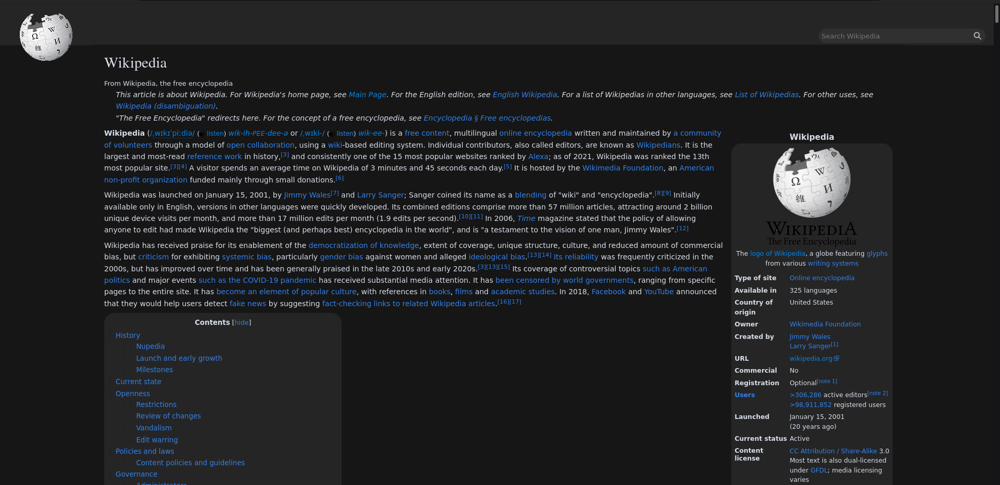

<h1 align="center">andromeda</h1>

![[Banner]](https://socialify.git.ci/azure-moon/andromeda/image?description=1&descriptionEditable=%F0%9F%8C%8C%20andromeda%20is%20minimal%20space-inspired%20theme%20for%20wikipedia&font=Raleway&language=1&logo=https%3A%2F%2Fupload.wikimedia.org%2Fwikipedia%2Fen%2Fthumb%2F8%2F80%2FWikipedia-logo-v2.svg%2F1024px-Wikipedia-logo-v2.svg.png&name=1&owner=1&theme=Dark)

## 🖼️ Preview

## ❗ Prerequisites
[Stylus browser extension](https://github.com/openstyles/stylus#releases)

## 💻 Installation

[Click here to install andromeda](https://github.com/lunar-theme/andromeda/raw/main/andromeda.user.css)

Before installation make sure you aren't using any extensions or different themes in wikipedia.

## 👤 Author

🐏 **sheep**

* 🌐 Website: https://sheepdev.xyz
* 📧 Email: [me@sheepdev.xyz](mailto:me@sheepdev.xyz)
* 🐦 Twitter: [@imsheeeep](https://twitter.com/imsheeeep)
* 💻 GitHub: [@sheeepdev](https://github.com/sheeepdev)
* 💬 Discord: [sheep#2428](https://discord.com/users/429303151598895106) (Friend requests disabled, DM me elsewhere and ill add you)

## 🤝 Contributing

Contributions, issues and feature requests are welcome! Feel free to check [issues page](https://github.com/azure-moon/andromeda/issues). 

## 🌟 Show your support

Give a ⭐️ if you like this project!

## 📝 Note

This is my **personal** theme, there may be some things that you won't like. You'll need to change that by yourself.
Colors are changable by editing the variables in the file.

## 📩 License

Copyright © 2021 [sheepdev](https://sheepdev.xyz/) 
This project is licensed under the [CC-BY-4.0](https://github.com/azure-moon/andromeda/blob/main/LICENSE) license.
